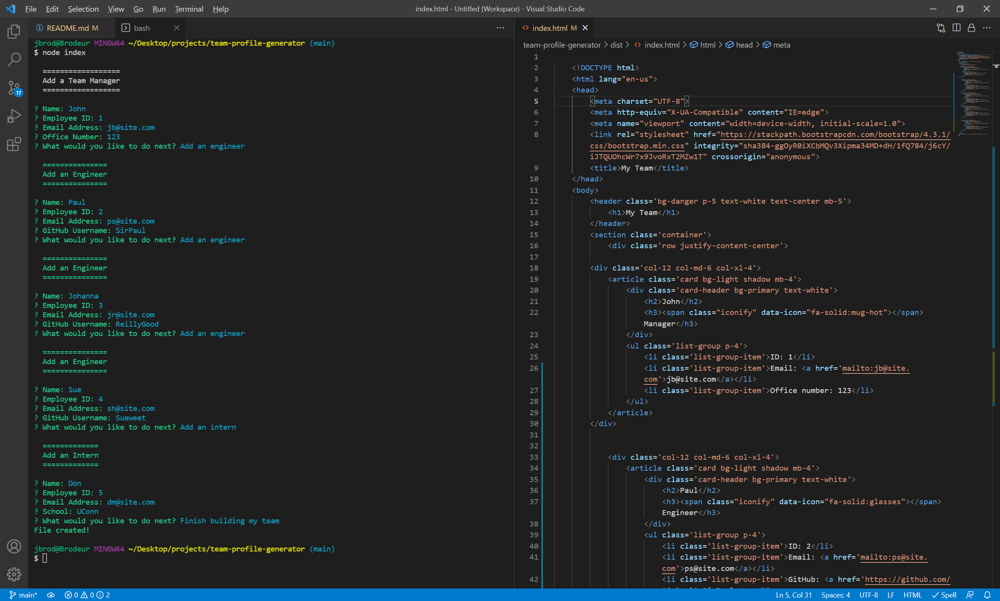
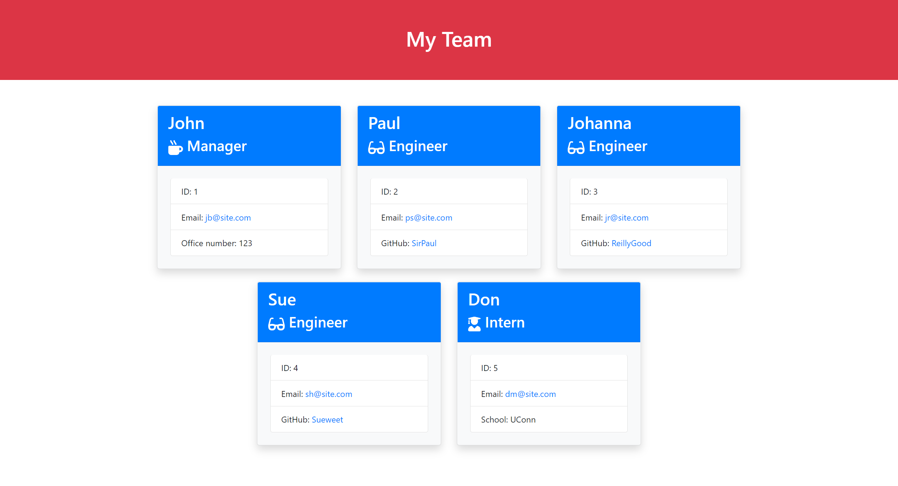

# Team Profile Generator

## Description

A Node.js command-line application that takes in information about employees on a software engineering team and generates an HTML webpage that displays summaries for each person.

## Table of Contents

* [Installation](#installation)
* [Usage](#usage)
* [License](#license)
* [Questions](#questions)

## Installation

1. Download this repo 
2. Install Node.js 
3. Install Inquirer 

## Usage

1. Open a Terminal
2. Navigate to the root folder of the repo 
3. Type 'node index' and hit enter
4. Answer each prompt
5. Once completed, access your HTML file in the /dist subdirectory

 👉 View a [Video Walkthrough](#)

## License

Distributed under the [Unlicense](https://choosealicense.com/licenses/unlicense/).

## Questions

* GitHub Profile: [JPDBrodeur](https://github.com/JPDBrodeur)

* Have any additional questions? You can reach me by email at [jbrodeur001@gmail.com](mailto:jbrodeur001@gmail.com).
    
